<h1 align="center"> Эмулятор "ГМД-70"/"ГМД-7012" для ЭВМ "Электроника-60"</h1>
<p align="center">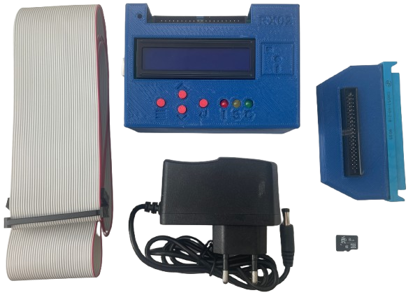</p>

##  Оглавление
* [Описание](#description)
* [Комплектация](#equipment)
* [Принцип работы](#operating)
* [Изготовление](#manufacturing)
    * [Покупка компонентов](#manufacturing_buy)
    * [Печатные платы](#manufacturing_pcb)
        * ['Адаптер'](#manufacturing_pcb_adapter)
        * ['Эмулятор'](#manufacturing_pcb_emulator)
    * [Сборка 'Адаптера'](#manufacturing_adapter_assembly)
    * [Сборка 'Эмулятора'](#manufacturing_emulator_assembly)
    * [Жгут](#manufacturing_cable)
* [Корпус](#manufacturing_case)
* [Прошивка](#firmware)
* [Проверка работоспособности](#test)

## <a name='description'></a>Описание
Устройство позволяет отказаться от использования накопителя `"ГМД-70"`/`"ГМД-7012"` (далее НГМД) в составе ЭВМ `"Электроника-60"`, заменив загрузку с дискет на загрузку с образов.
Образы дисков хранятся на `MicroSD` карте. 
"Эмулятор" представляет собой `"Arduino Shield"` (плата расширения) на базе `Arduino Mega2560`.

Ключевое преимущество прибора — автономность, обеспечивающая выбор нужных образов напрямую через само устройство, не требуя подключения к компьютеру.

## <a name='equipment'></a>Комплектация
- "Эмулятор"
- "Адаптер" (для подключения "Эмулятора" к плате "И-4" в составе ЭВМ)
- Жгут (соединяет эмулятор с адаптером)
- Блок питания
    * 9V DC
    * &#8805;500mA
    * Jack 5.5x2.1
    * полярность - прямая ("+" по центру)
- MicroSD card
    * 8GB
    * SDHC

## <a name='operating'></a>Принцип работы
Для понимания можно провести простую аналогию: 
при использовании реального накопителя оператор устанавливает дискету в один или оба доступных отсеков.
То же самое и с эмулятором. Через меню выбирается образ, который устанавливается в виртуальный отсек `[0]` или `[1]`. 
Проще говоря: вместо установки дискет указывается нужный образ в выбранном отсеке.

> [!TIP]  
> Для ЭВМ данный эмулятор выглядит точно так же как и физический накопитель. 

## <a name='manufacturing'></a>Изготовление

### <a name='manufacturing_buy'></a>Покупка компонентов
Купить компоненты можно на "ChipDip", "Ozon", "WB", "Aliexpress".
Обычно удобно всю мелочевку купить на "ChipDip", а остальное на маркетплейсах.

BOM-файл "Адаптер": [Интерактивный](https://v8355800.github.io/rx02_emulator/assets/bom/RX02_Adapter_ibom_v1.1.html) / [CSV](assets/bom/RX02_Emulator_bom_v1.2.csv)  
BOM-файл "Эмулятор": [Интерактивный](https://v8355800.github.io/rx02_emulator/assets/bom/RX02_Emulator_ibom_v1.2.html) / [CSV](assets/bom/RX02_Emulator_bom_v1.2.csv)

[Ссылка на "Корзину" в "ChipDip"](https://www.chipdip.ru/cart/share/P7Al1Tl6KI5sdudKpMeFdJT3irWuv8lbFa3mm7L9Bp3oRmtGSJEMUTi2QN5kUsKruICHdr5GWGdcOhvIBDb02yR9f8PagUMRVEMTWNeX60IBFPVu2m0RJdy3djSNJDYW2)  
[Excel-таблица покупок](assets/bom/Buy.xlsx)

> [!NOTE]  
> Количество компонентов указано для 10 комплектов.

### <a name='manufacturing_pcb'></a>Печатные платы
"Адаптер" и "Эмулятор" выполнены в виде двусторонних печатных плат под THT(выводные) компоненты, что упрощает процесс ручной сборки.
Размер плат не превышает `100x100mm`, поскольку многие производства предлагают существенные скидки на платы такого формата.
Заказать печатные платы можно на любом производстве (Резонит, JLCPCB и т.д.).
Параметры: `2 слоя, FR4 1.6mm, 1 Oz (35 µm), HASL, Зеленая маска, Белая шелкография`.  
Gerber-файлы находятся в папке ["gerbers"](gerbers/).

**<a name='manufacturing_pcb_adapter'></a>"Адаптер" - [Gerber-файлы](gerbers/rx02-emulator-adapter_v1.1.zip)**
|Верх|Низ|
|:-:|:-:|
|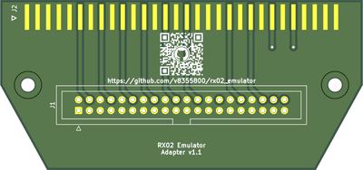|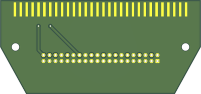|

**<a name='manufacturing_pcb_emulator'></a>"Эмулятор" - [Gerber-файлы](gerbers/rx02-emulator-mega-shield_v1.2.zip)**
|Верх|Низ|
|:-:|:-:|
|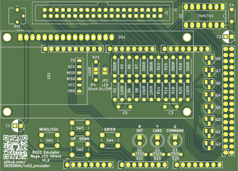|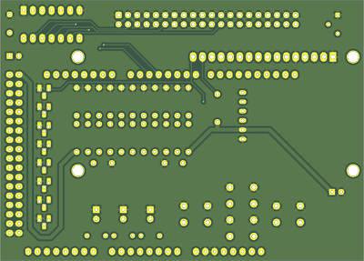|

### <a name='manufacturing_adapter_assembly'></a>Сборка "Адаптера"
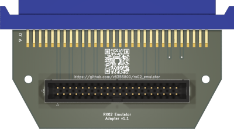

### <a name='manufacturing_emulator_assembly'></a>Сборка "Эмулятора"
|Верх|Низ|
|:-:|:-:|
|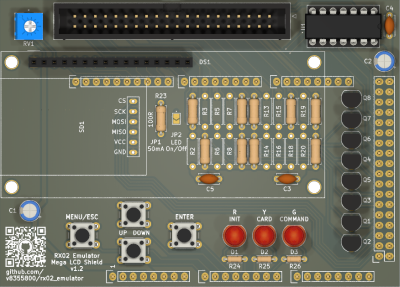|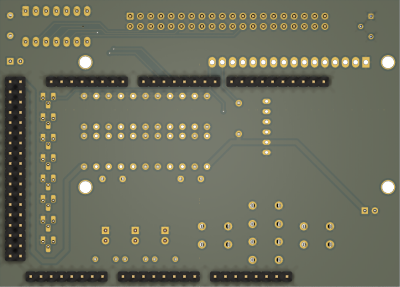|

**"U1" Микросхема**

||Микросхема|
|:-:|:-|
|Предпочтительно|`74HCT14`, `74AHCT14`|
|Приемлемо|`74HC14`, `74AHC14`|
|Не подходит|`7414`, `74LS14`, `74ALS14`, `74xx04` (any technology)|

Схема устанавливается по ключу (полукруглая выемка на микросхеме). 

**"R1-R22" Termination resistor table**\
Шелкография на плате облегчает определение какие резисторы требуется устанавливать. Если указан номинал, то резистор устанавливается, если нет, то установка не производится.

|Сигнал|Резистор|Номинал||Сигнал|Резистор|Номинал|
|:-----:|:-------:|:----:|-|:-----:|:-------:|:----:|
|RX_DMA_MODE_H|R1|390||RX_DONE_L|R13|-|
||R2|-|||R14|-|
|RX_AC_L|R3|-||RX_XFER_RQST_L|R15|-|
||R4|120|||R16|-|
|RX_OUT_L|R5|-||RX_INIT_L|R17|390|
||R6|-|||R18|-|
|RX_SHIFT_L|R7|-||RX_ERROR_L|R19|-|
||R8|-|||R20|-|
|RX_12_BIT_L|R9|390||RX_RUN_L|R21|390|
||R10|180|||R22|180|
|RX_DATA_L|R11|390|
||R12|180|

**"D1-D3" Светодиоды**\
Длина ножки `Анода` светодиодов, указанных в `BOM` составляет `16мм`. Нужно запаять так, чтобы они максимально выступали над платой, что обеспечит совпадение с отверстиями в корпусе.

|Светодиод|Цвет|Назначение|Описание|
|:-:|:-:|:-:|:-:|
|D1|Красный|INIT|**ON** - `INIT` устанавливается хостом или ошибка в эмуляторе.<br>**OFF** - в начале команды.|
|D2|Желтый|CARD|**ON** - эмулятор обращается к `MicroSD` карте.<br>**OFF** в противном случае.|
|D3|Зеленый|COMMAND|**ON** - хост отправляет команду.<br>**OFF** - команда выполнена (`DONE` установлен).|

Во время нормальной работы `D2`, `D3` быстро мигают или в основном горят. Для команд, не связанных с хранением (например заполнение/очистка буфера) будет включен только `D3`.

**"JP1" Перемычка**  
Используется для регулирования тока подсветки экрана `LCD1602`.  
Замкнута - ток проходит без ограничений.  
Разомкнута - в цепь включается токоограничивающий резистор `R23`.  
Номинал `R23` составляет `100 Ом`, что обеспечивает максимальный ток подсветки — `50 мА`.  
По умолчанию перемычка не запаивается, резистор `R23` устанавливается.

**"JP2" Перемычка**  
Используется для выбора метода управления подсветкой дисплея `LCD1602`.  
Замкнута - подсветка дисплея постоянно включена, установка транзистора `Q8` не требуется.  
Разомкнута - подсветкой управляет Arduino, требуется установка транзистора `Q8`.  
По умолчанию перемычка не запаивается.

**"P1-P7" Штырьевые разъемы**  
`PLS`, `PLD` запаиваются с нижней стороны платы. С помощью кусачек нарезаются `PLS-40` и `PLD-40` нужной длины.
|Pos|Type|Num|
|:-:|:-:|:-:|
|P1|PLD|36|
|P5|PLS|10|
|P2-P4, P6-P7|PLS|8|

**"SD1" SPI адаптер карт MicroSD**
|MicroSD|Сборка 1|Сборка 2|
|:-:|:-:|:-:|
|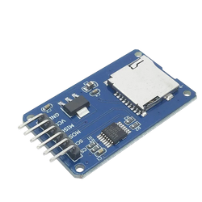||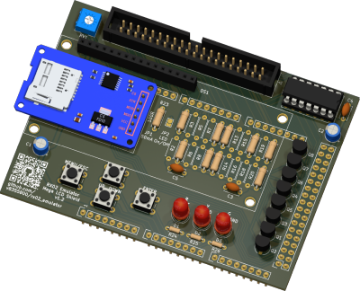|

Необходимо выпаять угловой разъем который установлен с завода на плате адаптера. На его место снизу запаять `PLS-6`. Затем впаять в печатную плату на место `SD1`. Нужно выдержать горизонтальность. Этого можно легко добиться, если во время пайки между платой и адаптером подложить спейсеры (черные квадратики которые можно снять с углового разъема, если вытащить пины).

> [!WARNING]
> Если при включении устройство зависает на экране с номером версии прошивки, то убедиться что `MicroSD` карта установлена.

**"DS1" Символьный дисплей LCD1602 (2 строки по 16 символов)**
|LCD1602|Сборка 1|
|:-:|:-:|
|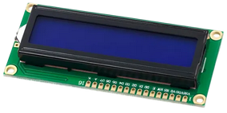|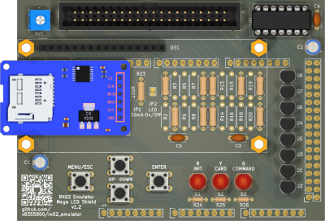|

|Сборка 2|Сборка 3|
|:-:|:-:|
|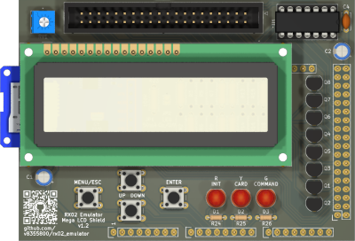|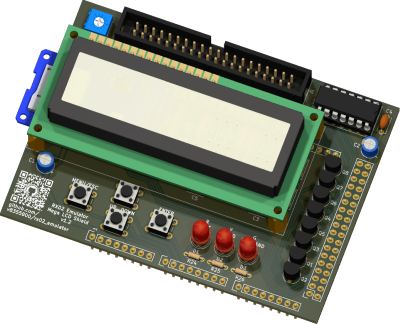

На место `DS1` печатной платы сверху запаять гнездо `PBS-16`. На `LCD1602` снизу запаять вилку `PLS-16`.
При установке дисплея на плату в четырех углах между платой и дисплеем установить стойки длиной `11мм`. Закрепить стойки к печатной плате и дисплею с помощью восьми винтов `М3`.

> [!TIP]
> Модификация с модулем `I<sup>2</sup>C` не нужна.

> [!WARNING]
> При первом включении необходимо отрегулировать контрастность дисплея с помощью подстроечного резистора `RV1`. Это можно сделать через имеющееся отверстие в корпусе с помощью крестовой отвертки. В противном случае на дисплее может ничего не отображаться и будет казаться, что устройство не работает.

### <a name='manufacturing_cable'></a>Жгут
|Кремпер|IDC-40F|
|:-:|:-:|
||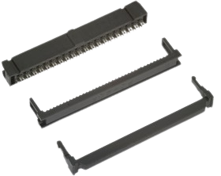|

На плоский шлейф нужной длины установить с обоих концов розетки `IDC-40F`. Это можно сделать используя специальный кримпер для обжима или с помощью подручных средств. Важно следить чтобы ключ первого контакта на обоих разъемах совпадал с первым проводом шлейфа (обычно помечен красным цветом).  

> [!WARNING]
> Рекомендованная длина жгута - `0.5÷1.5м`.

## <a name='manufacturing_case'></a>Корпус
|Адаптер|Эмулятор|
|:-:|:-:|
|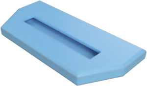|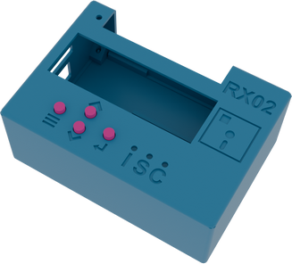|

Корпуса для "Эмулятора" и "Адаптера" можно распечатать на 3D-принтере.

STL-файлы для печати находятся в папке ["3D"](assets/3D):
* Корпус "Адаптера"  
    * [Верхняя крышка](assets/3D/RX02_Adapter_Top.stl)
    * [Нижняя крышка](assets/3D/RX02_Adapter_Bottom.stl)
* Корпус "Эмулятора"  
    * Верхняя крышка: [(Китайский клон)](assets/3D/RX02_Shield_Body_CH340.stl)/[(Оригинал Arduino)](assets/3D/RX02_Shield_Body_Orig.stl)
    * [Нижняя крышка](assets/3D/RX02_Shield_Lid.stl)
    * [Кнопки меню (4шт.)](assets/3D/RX02_Shield_Button.stl)

> [!NOTE]  
> Верхняя крышка "Эмулятора" различается для китайского клона "Arduino Mega 2560 R3 (USB CH340)" и оригинальной версии. Различия заключаются в расположении боковых вырезов. Скорее всего вам понадобиться вариант для клона.

> [!TIP]  
> Поддержки можно не использовать.  
> Для фиксации нижней крышки "Эмулятора" используется саморез `M3`.  
> Для 10 комплектов корпусов хватит одной катушки 1кг.

## <a name='firmware'></a>Прошивка
Я использую «Arduino-совместимые» китайские платы, у которой для подключения по USB используется контроллер CH340/CH341. Чтобы он распознавался компьютером, нужно установить [`драйвер`](https://wch-ic.com/downloads/CH341SER_EXE.html). Если используется плата с другим контроллером, то нужно установить другой драйвер, соответствующий контроллеру конкретной платы.

Плата подключается к компьютеру по USB с помощью кабеля USB Type-B, на ней должны замигать светодиоды. Компьютер издаст характерный сигнал подключения нового оборудования, а при первом подключении появится окошко “Установка нового оборудования”.

В системе появиться новый COM порт с произвольным номером. Проверить можно через "Диспетчер устройств" в разделе "Порты (COM и LPT)".

<p align="center">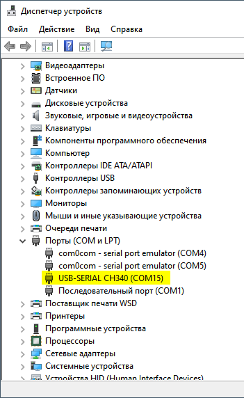</p>

С помощью [`"xLoader"`](https://github.com/binaryupdates/xLoader) загрузить прошивку из папки [`"firmware"`](firmware/) на устройство.  
* Hex file: [`"rx02_emulator_lcd_and_buttons v2.1.hex"`](firmware/rx02_emulator_lcd_and_buttons%20v2.1.hex)
* Device: `Mega(ATMEGA2560)`
* COM port: `порт Arduino`
* Baud rate: `115200`
<p align="center">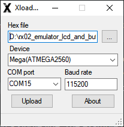</p>

## <a name='test'></a>Проверка работоспособности
* Подключить эмулятор с помощью адаптера к плате "И-4" вместо "НГМД".
* Записать образы ОС ["RT-11.DSK"](test/RT-11.dsk) и ["TMOS.dsk"](test/TMOS.dsk) на MicroSD карту из папки ["Test"](test/).
* Установить MicroSD карту в эмулятор.
* Подключить питание к эмулятору с помощью блока питания.
* В меню выбрать образы ОС для `[0]` и `[1]` отсеков.
* Проверить загрузку ОС с образа в `[0]` отсеке.
* Проверить загрузку ОС с образа в `[1]` отсеке:  
    ```
    R2/100267
    173004G
    ```
